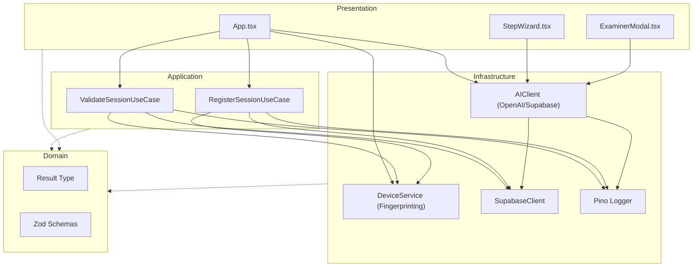

# Essay Architect Pro - Architectural Overview

This project follows a strict **Hexagonal Architecture** (Ports and Adapters) with **Single-Purpose Use Cases**, **Constructor Injection**, and **Functional Error Handling**.

## System Flow



## Key Architectural Principles

1.  **Dependency Injection**: All services in `infrastructure/` and `application/` use constructor injection. Singletons and global service locators are prohibited.
2.  **Use Case Pattern**: Business logic is encapsulated in small, focused Use Case classes (e.g., `RegisterSessionUseCase`).
3.  **Boundary Validation**: All external data (API responses, local storage) is validated using **Zod** schemas.
4.  **Functional Error Handling**: Instead of throwing exceptions, services return a `Result<T, E>` object, forcing the caller to handle both success and failure states.
5.  **Structured Logging**: `pino` is used for consistent, traceable logging across all layers.
6.  **Traceability**: A `correlationId` is generated at the application layer to track the lifecycle of each request.

## Project Structure

- `src/domain/`: Pure logic, Zod schemas, and interfaces.
- `src/infrastructure/`: Implementation of external services (APIs, DBs, Loggers).
- `src/application/`: Orchestration of business logic using Use Cases.
- `src/presentation/`: React components and UI logic.

Run the full verification suite with:

```bash
npm run check
```

This executes: `format` → `lint` → `type-check` → `test` → `test:architecture` → `knip`.
