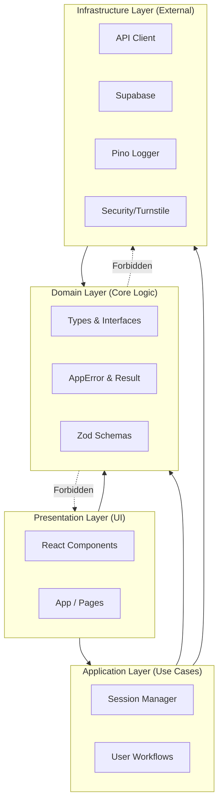

# Essay Architect Pro (Strict Edition)

A professional academic writing assistant built with a strict 4-layer architecture, robust error handling, and a blazing-fast toolchain.

## 🏗️ Architecture

This project strictly follows a **Domain-Centric** layered architecture to ensure separation of concerns and maintainability.



### Layers
1.  **Domain**: Pure business logic, types, errors, and validation schemas. No external dependencies.
2.  **Infrastructure**: Implementation of external services (API, Auth, Logging).
3.  **Application**: Orchestration of domain logic and infrastructure to fulfill user use cases.
4.  **Presentation**: React components and UI logic.

## 🛡️ Strict Compliance Features

-   **Type Safety**: `@tsconfig/strictest` enabled. No `any`.
-   **Validation**: Runtime validation with `zod` at all boundaries.
-   **Error Handling**: Functional error handling using `Result<T, E>`. No thrown exceptions in business logic.
-   **Observability**: Structured logging with `pino` and correlation IDs.
-   **Toolchain**:
    -   `oxlint` for instant linting.
    -   `vitest` for testing.
    -   `dependency-cruiser` for architectural enforcement.

## 🚀 Getting Started

### Prerequisites
-   Node.js (LTS)
-   npm

### Installation

```bash
npm install
```

### Development

```bash
npm run dev
```

### Verification (The "Check" Loop)

Running the full suite of checks:

```bash
npm run check
```

This runs:
1.  Format (`prettier`)
2.  Lint (`oxlint`)
3.  Type Check (`tsc`)
4.  Tests (`vitest`)
5.  Architecture Check (`dependency-cruiser`)

## 📂 Project Structure

```
src/
├── domain/           # Core types, errors, schemas
├── infrastructure/   # API, logging, db, security
├── application/      # Session management, logic
├── presentation/     # React components, modals
└── main.tsx          # Entry point
```

## 📜 License

Proprietary Software.
