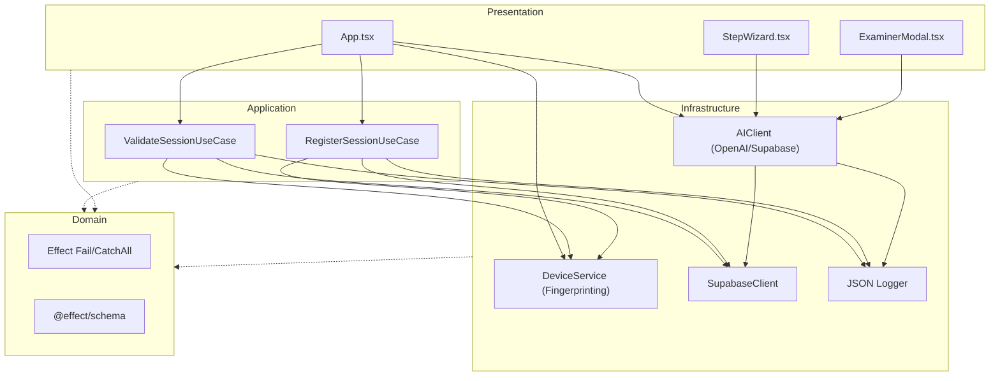

# Essay Architect Pro - Architectural Overview

This project follows a strict **Hexagonal Architecture** (Ports and Adapters) with **Single-Purpose Use Cases**, **Constructor Injection**, and **Functional Error Handling**.

## System Flow



## Key Architectural Principles

1.  **Effect ecosystem as the Standard Library**: We use `Effect` for all control flow, dependency injection, concurrency, error handling, and validation.
2.  **Zero Escape Hatches**: 
    - No `throw` or `try/catch` (all errors are modeled in the type signature using `Effect.fail` and `AppError extends Data.TaggedError`).
    - No `async/await` in production (all async boundaries managed via `Effect.gen` and `Effect.tryPromise`).
    - No `let`, `Mutation`, or `for` loops (state is immutable; iteration is declarative).
    - No `any` or loose indexing in production.
    - No `Zod` (we exclusively use `@effect/schema`).
3.  **Structured Observability**: A custom JSON logger replaces standard console output, providing machine-readable logs with timestamps, correlation IDs, and stable tags across all layers.
4.  **Use Case Pattern**: Business logic is encapsulated in small, focused Use Case classes (e.g., `RegisterSessionUseCase`).
5.  **Dependency Injection**: All services use full Effect constructor injection and Context providers. Singletons and global service locators are prohibited.

## Project Structure

- `src/domain/`: Pure logic, Zod schemas, and interfaces.
- `src/infrastructure/`: Implementation of external services (APIs, DBs, Loggers).
- `src/application/`: Orchestration of business logic using Use Cases.
- `src/presentation/`: React components and UI logic.

Run the full verification suite with:

```bash
npm run check
```

This executes: `format` → `lint` → `type-check` → `test` → `test:architecture` → `knip`.
